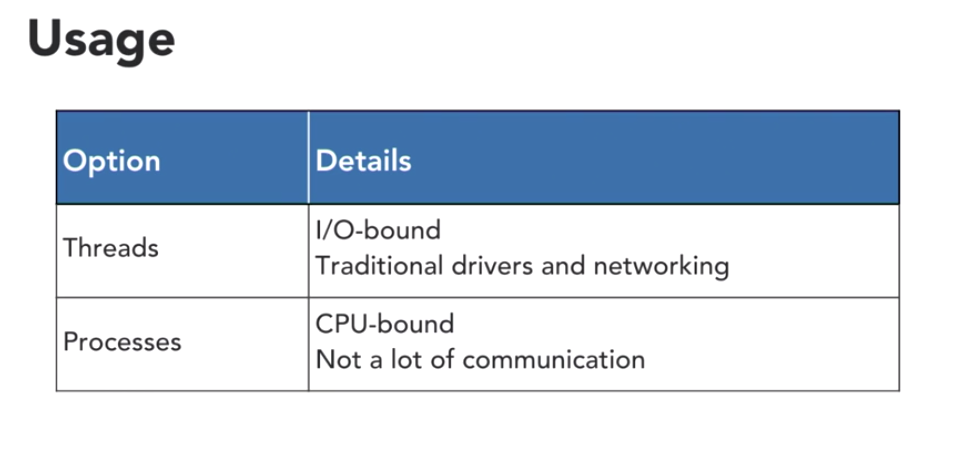

**Parallel Computing**

-  Not same as concurrency 
- `IO BOUND` - Spends most of the time waiting for input and output form network or disk
- `CPU bound` - Most of the time doing calculations
- `Threads` `Process` `AsyncIo`
-  Most of the python data structures are `not thread safe`, if two or more thread access the same data structure you will get undefined result
-  Processes RE INDEPENDENT saperate memory so process communication will be expensive

**Threads**

- Python data structure are not thread safe
- Newer versions include concurrent.futures

